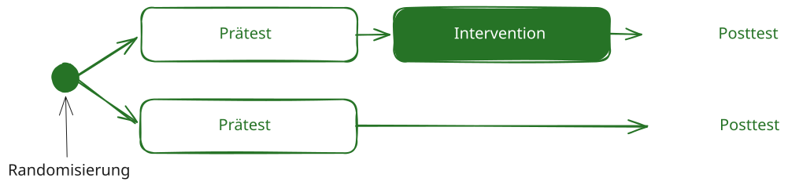

## Was ist Randomisierung?

Randomisierung bezeichnet die **zufällige Zuweisung von Untersuchungseinheiten** zu verschiedenen Untersuchungsbedingungen, beispielsweise zu einer Interventions- und einer Kontrollbedingung. Untersuchungseinheiten können einzelne Personen, aber auch ganze Klassen oder Schulen sein.

Welche Einheit randomisiert wird, muss zum Forschungsdesign passen:

- Bei einer **Individualrandomisierung** werden einzelne Schüler:innen zugewiesen.
- Bei einer **Cluster-Randomisierung** werden ganze Klassen oder Schulen zugewiesen.

Durch die zufällige Zuweisung werden bekannte Merkmale, etwa Vorwissen, Motivation oder Alter, und unbekannte Einflussfaktoren im Erwartungswert auf die Untersuchungsbedingungen verteilt. Dadurch sinkt das Risiko systematischer Ausgangsunterschiede.

Randomisierung stärkt die **interne Validität** einer Studie und bildet eine wichtige Grundlage für kausale Schlussfolgerungen. Sie garantiert jedoch nicht, dass kleine Gruppen in allen Merkmalen ausgeglichen sind.


## Zentrale Funktionen der Randomisierung

Randomisierung soll verhindern, dass die Gruppenzuweisung gezielt oder vorhersehbar von Merkmalen der Untersuchungseinheiten beeinflusst wird. Dadurch werden insbesondere folgende Risiken reduziert:

- systematische Auswahl leistungsstärkerer oder motivierterer Teilnehmender,
- bewusste oder unbewusste Einflussnahme auf die Zuweisung,
- Verzerrungen durch bekannte und unbekannte Störvariablen.

Eine überzeugende Randomisierung setzt voraus, dass das Verfahren korrekt durchgeführt, dokumentiert und gegen vorhersehbare Einflussnahme abgesichert wird.

## Beispiel aus der Deutschdidaktik

Eine Studie untersucht ein neues Lesestrategieprogramm. Mehrere Klassen nehmen teil. Ein Teil der Klassen wird zufällig der Interventionsbedingung zugewiesen, die übrigen Klassen der Kontrollbedingung.

{fig-align="center" width="100%"}

Eine gezielte Zuweisung könnte dazu führen, dass beispielsweise besonders leistungsstarke Klassen das neue Programm erhalten. Unterschiede im Abschlusstest wären dann nur schwer als Wirkung des Programms zu interpretieren. Die zufällige Zuweisung reduziert dieses Risiko.

::: {.callout-warning title="Eine Klasse pro Bedingung reicht nicht aus"}
Werden nur eine Klasse der Intervention und eine Klasse der Kontrollbedingung zugewiesen, sind **Klasse und Bedingung vollständig miteinander konfundiert**. Ein beobachteter Unterschied kann dann ebenso auf die Lehrkraft, das Klassenklima, das Leistungsniveau oder andere Besonderheiten der Klassen zurückgehen.

Auch eine zufällige Zuweisung von lediglich zwei Klassen löst dieses Problem nicht. Für einen belastbaren Vergleich werden mehrere unabhängig randomisierte Klassen oder Schulen pro Bedingung benötigt.
:::

## Möglichkeiten der zufälligen Zuweisung

### Individualrandomisierung

Bei der **Individualrandomisierung** wird jede einzelne Person mit einer festgelegten Wahrscheinlichkeit einer Untersuchungsbedingung zugewiesen, zum Beispiel mithilfe eines Zufallszahlengenerators.

**Beispiel:** Schüler:innen aus mehreren Klassen werden einzeln einer digitalen Übungsbedingung oder einer Vergleichsbedingung zugewiesen.

**Vorteil:** Bei ausreichend großer Stichprobe können sich Personenmerkmale gut auf die Bedingungen verteilen.

**Zu beachten:** In schulischen Studien kann die individuelle Zuweisung organisatorisch schwierig sein. Zudem können sich Schüler:innen verschiedener Bedingungen gegenseitig beeinflussen, wenn sie gemeinsam unterrichtet werden.

### Cluster-Randomisierung

Bei einer **Cluster-Randomisierung** werden bestehende Gruppen, beispielsweise Klassen oder Schulen, als Ganzes zufällig einer Untersuchungsbedingung zugewiesen.

**Beispiel:** Acht Klassen nehmen an einer Studie zur Schreibförderung teil. Vier Klassen werden der neuen Schreibintervention und vier Klassen dem regulären Unterricht zugewiesen.

Die Klasse ist in diesem Fall die **Randomisierungseinheit**. Die einzelnen Schüler:innen sind Beobachtungseinheiten innerhalb dieser Cluster.

::: {.callout-important title="Nicht nur die Zahl der Schüler:innen zählt"}
Schüler:innen innerhalb derselben Klasse ähneln sich häufig stärker als Schüler:innen aus unterschiedlichen Klassen. Deshalb liefern 100 Schüler:innen aus einer einzigen Klasse nicht dieselbe unabhängige Information wie 100 Schüler:innen aus mehreren Klassen.

Für Planung und Auswertung sind insbesondere die Zahl der randomisierten Klassen oder Schulen und die Ähnlichkeit der Schüler:innen innerhalb dieser Cluster relevant. Die hierarchische Datenstruktur muss statistisch berücksichtigt werden.
:::

### Stratifizierte Randomisierung

Bei der **stratifizierten Randomisierung** werden Untersuchungseinheiten zunächst anhand eines wichtigen Merkmals in Teilgruppen eingeteilt und anschließend innerhalb dieser Teilgruppen randomisiert.

**Beispiel:** Klassen werden anhand ihres mittleren Vortestniveaus in Klassen mit höherem und niedrigerem Ausgangsniveau eingeteilt. Innerhalb beider Gruppen werden die Klassen anschließend zufällig auf Intervention und Kontrolle verteilt.

Die Stratifizierung kann dazu beitragen, dass wichtige Ausgangsmerkmale in beiden Bedingungen vertreten sind. Sie ersetzt jedoch keine ausreichende Zahl von Untersuchungseinheiten.

::: {.callout-note title="Weitere Verfahren"}
Zu den weiterführenden Verfahren gehört die **Blockrandomisierung**. Sie wird eingesetzt, um während der Zuweisung ein festgelegtes Verhältnis zwischen den Bedingungen zu erhalten. Bei wenigen Clustern kommen außerdem eingeschränkte oder paarweise Randomisierungsverfahren infrage; ihre Planung sollte designspezifisch erfolgen.
:::

## Randomisierungseinheit und Auswertung

Die Einheit der Randomisierung bestimmt, welche Beobachtungen als unabhängig gelten und wie die Daten ausgewertet werden müssen.

| Randomisierung | Randomisierungseinheit | Typische Auswertung |
|---|---|---|
| einzelne Schüler:innen | Person | Analyse auf Personenebene |
| ganze Klassen | Klasse | Mehrebenenmodell oder clusterrobuste Verfahren |
| ganze Schulen | Schule | Mehrebenenmodell oder clusterrobuste Verfahren |

Wird auf Klassenebene randomisiert, darf die Auswertung die Schüler:innen nicht so behandeln, als wären sie vollständig unabhängig voneinander. Andernfalls werden Standardfehler häufig unterschätzt und Ergebnisse können zu sicher erscheinen.

## Wenn keine Randomisierung möglich ist

In schulischen Studien können organisatorische oder institutionelle Vorgaben eine zufällige Zuweisung verhindern. Dann handelt es sich um ein **quasi-experimentelles Design**.

Matching kann helfen, möglichst ähnliche Vergleichsgruppen zu bilden. Dabei werden Personen, Klassen oder Schulen anhand wichtiger Merkmale einander zugeordnet, zum Beispiel anhand von:

- Vortestleistung,
- Klassenstufe,
- Schulform,
- Klassengröße,
- sozioökonomischer Zusammensetzung.

Matching kann die Vergleichbarkeit verbessern. Es ersetzt jedoch keine Randomisierung, weil nur bekannte und gemessene Merkmale berücksichtigt werden können. Unbeobachtete Unterschiede können weiterhin die Ergebnisse verzerren.

Weiterführende Verfahren sind beispielsweise Propensity-Score-Verfahren und die statistische Kontrolle durch Kovariaten.

## Gruppen nach der Randomisierung beschreiben

Nach der Randomisierung sollten die Ausgangsmerkmale der Bedingungen **deskriptiv dargestellt** werden, beispielsweise:

- Vortestleistungen,
- Alter oder Klassenstufe,
- Klassengröße,
- weitere für die Forschungsfrage relevante Merkmale.

Mittelwerte, Standardabweichungen und Verteilungen zeigen, wie die entstandenen Gruppen zusammengesetzt sind. Bei Cluster-Randomisierung sollten zusätzlich Merkmale der Klassen oder Schulen beschrieben werden.

::: {.callout-important title="Randomisierung nicht nachträglich testen"}
Unterschiede zwischen den Bedingungen bedeuten nicht automatisch, dass die Randomisierung fehlgeschlagen ist. Gerade bei kleinen Stichproben oder wenigen Clustern können zufällige Unterschiede auftreten.

Signifikanztests eignen sich daher nicht als Prüfung, ob eine Randomisierung „erfolgreich“ war. Entscheidend ist, dass die Zuweisung korrekt, zufällig und ohne vorhersehbare Einflussnahme durchgeführt wurde. Inhaltlich relevante Ausgangsunterschiede können bei der Auswertung berücksichtigt werden.
:::

<!--

## Interaktives Tool: Randomisierung durchführen

Dieses Beispiel dient ausschließlich zur Illustration der grundlegenden Zusammenhänge. Für Prä-Post-Designs, mehrere Messzeitpunkte, Cluster-Randomisierung, ungleiche Gruppengrößen oder hierarchische Daten ist eine designspezifische Poweranalyse erforderlich.

```{ojs}
//| echo: false
//| eval: false


viewof n_participants = Inputs.range([10, 200], {
  value: 40,
  step: 1,
  label: "Anzahl Teilnehmende"
})

viewof n_groups = Inputs.range([2, 4], {
  value: 2,
  step: 1,
  label: "Anzahl Gruppen"
})

viewof group_names = Inputs.text({
  label: "Gruppennamen (durch Komma getrennt)",
  value: "Experimentalgruppe, Kontrollgruppe",
  placeholder: "Gruppe 1, Gruppe 2, ..."
})

viewof do_randomize = Inputs.button("Randomisierung durchführen")
```

```{ojs}
//| echo: false

// Randomisierungsfunktion
function randomizeParticipants(n, groups) {
  const groupList = groups.split(',').map(g => g.trim()).slice(0, n_groups);
  
  // Erstelle Array von Teilnehmer-IDs
  const participants = Array.from({length: n}, (_, i) => i + 1);
  
  // Fisher-Yates Shuffle
  for (let i = participants.length - 1; i > 0; i--) {
    const j = Math.floor(Math.random() * (i + 1));
    [participants[i], participants[j]] = [participants[j], participants[i]];
  }
  
  // Weise Gruppen zu
  const assignments = participants.map((id, index) => ({
    id: id,
    group: groupList[index % groupList.length]
  }));
  
  // Zähle Gruppengröße
  const groupCounts = {};
  groupList.forEach(g => groupCounts[g] = 0);
  assignments.forEach(a => groupCounts[a.group]++);
  
  return { assignments, groupCounts, groupList };
}

// Führe Randomisierung durch
randomization = {
  do_randomize; // Abhängigkeit vom Button
  return randomizeParticipants(n_participants, group_names);
}

// Zeige Ergebnisse
html`
<div style="background: #f8f9fa; padding: 25px; border-radius: 10px; margin: 20px 0;">
  <h3 style="color: #2c3e50; margin-top: 0;">📋 Randomisierungsergebnis</h3>
  
  ${randomization.groupList.map(group => {
    const count = randomization.groupCounts[group];
    const percentage = ((count / n_participants) * 100).toFixed(1);
    const barWidth = (count / n_participants) * 100;
    
    return `
      <div style="margin: 15px 0;">
        <div style="display: flex; justify-content: space-between; margin-bottom: 5px;">
          <strong>${group}</strong>
          <span>${count} Personen (${percentage}%)</span>
        </div>
        <div style="background: #e9ecef; border-radius: 10px; overflow: hidden; height: 30px;">
          <div style="background: linear-gradient(90deg, #667eea 0%, #764ba2 100%); 
                      width: ${barWidth}%; height: 100%; 
                      transition: width 0.3s ease;
                      display: flex; align-items: center; justify-content: center;
                      color: white; font-weight: bold;">
            ${count > 0 ? count : ''}
          </div>
        </div>
      </div>
    `;
  }).join('')}
  
  <div style="margin-top: 25px; padding: 15px; 
              background: #e3f2fd; border-left: 4px solid #2196f3; border-radius: 5px;">
    <p style="margin: 0; color: #1565c0;">
      <strong>💡 Hinweis:</strong> Jedes Mal, wenn Sie "Randomisierung durchführen" klicken, 
      wird eine neue zufällige Zuweisung erstellt. Beachten Sie, wie die Gruppengröße leicht 
      variieren kann, besonders wenn die Teilnehmerzahl nicht durch die Anzahl der Gruppen teilbar ist.
    </p>
  </div>
</div>
`
```

## Randomisierungsliste herunterladen

```{ojs}
//| echo: false

// Erstelle CSV-Download
csv_content = {
  const header = "Teilnehmer_ID,Gruppe\n";
  const rows = randomization.assignments
    .map(a => `${a.id},${a.group}`)
    .join('\n');
  return header + rows;
}

html`
<div style="margin: 20px 0;">
  <a href="${'data:text/csv;charset=utf-8,' + encodeURIComponent(csv_content)}" 
     download="randomisierung.csv"
     style="display: inline-block; background: #28a745; color: white; 
            padding: 12px 24px; text-decoration: none; border-radius: 6px;
            font-weight: bold; box-shadow: 0 2px 5px rgba(0,0,0,0.2);">
    📥 Randomisierungsliste als CSV herunterladen
  </a>
</div>
`
```

-->